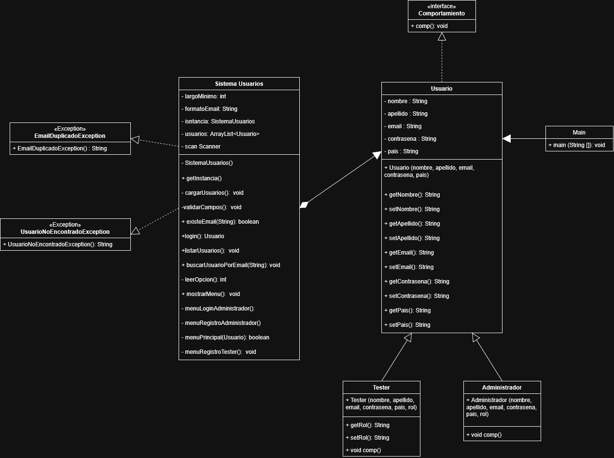

Funcionalidades:

Inicio de sesión
Permite acceder al sistema con un usuario.
Datos: email, contraseña

Registrar usuario admin
Permite registrar un usuario
Datos: nombre, apellido, mail, contraseña, pais nacimiento

Ver usuarios
Permite ver todos los usuarios registrados

Reiniciar contraseña
Permite reestablecer la contraseña de un usuario.
Datos: email, contraseña

Alta de cuenta para tester
Registrar usuario tester.
Datos: Nombre, Apellido, Email, Pais, Contraseña, Tipo de Tester (Jr., Sr., Líder)

Ver y editar perfil de usuario admin
Permite ver datos del propio usuario y editarlos.
Eliminar usuario	
Permite eliminar un usuario de tester 

20/5/2026

Se implementaron las funcionalidades basicas
Login
Registro

Validaciones de funcionalidades Login y Registro
Verificar usuario existente
Validar credenciales

6/8/2026

Se crearon las clases :

Usuario
SistemaUsuarios
Main
Tester
Administrador

Se agregaron:

atributos privados
getters/setters
constructor

Se incorporo la herencia en Adminitrador y Tester

Diagrama UML

class Main {
+main(String[])
}

class Usuario {
-String nombre
-String apellido
-String email
-String contrasena
-String pais
-String rol

    +Usuario(nombre, apellido, email, contrasena, pais, rol)
    +getNombre() String
    +getApellido() String
    +getEmail() String
    +getContrasena() String
    +getPais() String
    +getRol() String
    +setNombre()
    +setApellido()
    +setEmail()
    +setContrasena()
    +setPais()
    +setRol()
}

class SistemaUsuarios {
-ArrayList~Usuario~ usuarios
-Scanner scan

    -cargarUsuarios() String
    +existeEmail(boolean) String
    +login() String
    +listarUsuarios() String
    +mostrarMenu() String
    +menuLogin() String
    +menuRegistro() String
}

class Tester {
+Tester(nombre, apellido, email, contrasena, pais, rol)
}

class Administrador {
+Administrador(nombre, apellido, email, contrasena, pais, rol)
}

7/17/2026

Se dividieron los menu por rol: Menu de acceso y Menu principal
Menu de acceso: Login y registro de Administrador
Menu principal: Permite registrar Tester, buscar usuario, listar usuario,salir

Se quitó el atributo "rol" a Usuario y se movio a la clase Tester.

7/18/2026

Manejo de excepciones

Se crearon dos excepciones personalizadas en un package diferente:
- EmailDuplicadoException: se lanza al intentar registrar un email ya existente
- UsuarioNoEncontradoException: se lanza cuando un login o búsqueda no encuentra el usuario esperado.

Tambien se utilizaron excepciones estandar de Java

- InputMismatchException: entrada no numérica en el menú.
- IllegalArgumentException: opción de menú inexistente

7/19/2026

Validacion de datos

Campos obligatorios no vacios
Formato de email valido con expresion regular de java
Longitud minima de la contraseña de 5 digitos

Patron Singleton:

Se cambio el contructor de SistemaUsuarios de public a private
Se agrego atributo estático
Se agregó el método public static SistemaUsuarios getInstancia()

Actualizacion de diagrama UML

